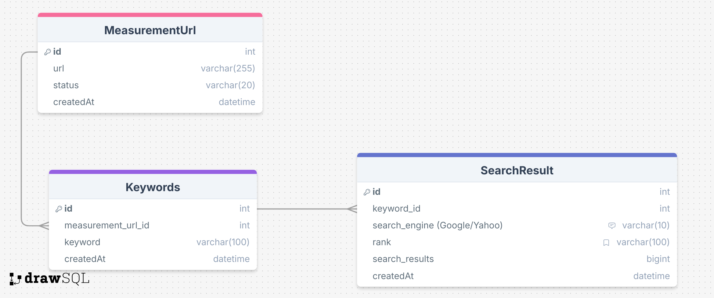

# API Documentation for Keyword Ranking System

## Table of Contents
1. [Database Design](#1-database-design)
    - [ER Diagram](#er-diagram)
2. [Design an API between React and Laravel](#2-design-an-api-between-react-and-laravel)
    - [POST /api/v1/search-ranking](#api)
3. [Please suggest one improvement to this system](#3-please-suggest-one-improvement-to-this-system)
4. [Assumptions](#assumptions)

---

## 1. Database Design
We will design a database with 3 tables :

```sql
CREATE TABLE `MeasurementUrl`(
    `id` INT AUTO_INCREMENT PRIMARY KEY,
    `url` VARCHAR(255) NOT NULL,
    `status` VARCHAR(20) NOT NULL DEFAULT 'processing' COMMENT 'processing | completed | failed',
    `createdAt` DATETIME DEFAULT CURRENT_TIMESTAMP
);
CREATE TABLE `Keywords`(
    `id` INT AUTO_INCREMENT PRIMARY KEY,
    `measurement_url_id` INT NOT NULL,
    `keyword` VARCHAR(100) NOT NULL,
    `createdAt` DATETIME DEFAULT CURRENT_TIMESTAMP,
    CONSTRAINT `keywords_measurement_url_id_fk` FOREIGN KEY (`measurement_url_id`) REFERENCES `MeasurementUrl` (`id`)
);

CREATE TABLE `SearchResult`(
    `id` INT AUTO_INCREMENT PRIMARY KEY,
    `keyword_id` INT NOT NULL,
    `search_engine` VARCHAR(10) NOT NULL COMMENT 'Google | Yahoo',
    `rank` VARCHAR(100) NOT NULL DEFAULT 'out of rank',
    `search_results` BIGINT NOT NULL,
    `createdAt` DATETIME DEFAULT CURRENT_TIMESTAMP,
    CONSTRAINT `search_result_keyword_id_fk` FOREIGN KEY (`keyword_id`) REFERENCES `Keywords` (`id`)
);
```

## ER Diagram


### Example Database

### MeasurementUrl Table
| id | url                      |  status     |  createdAt |
|----|-------                   |-------------|-------------|
| 1  | https://allgrow-labo.jp  | completed   | 2024-09-30 10:07:15 | 
| 2  | https://google.com       | processing  | 2024-10-01 10:07:15 | 
| 3  | https://demo.com         | failed      | 2024-10-01 10:07:15 | 

### Keywords Table
| id | measurement_url_id | keyword   |  createdAt |
|----|------- |---------  |-------------|
| 1  | 1      | keyword 1 | 2024-09-30 10:07:15 | 
| 2  | 1      | keyword 2 | 2024-09-30 10:07:15 | 

### SearchResult Table
| id | keyword_id | search_engine | rank        | search_results | createdAt |
|----|-------     |-------------  |------       |-------------   |-------------|
| 1  | 1          | Google        | 1           | 1000            | 2024-09-30 10:07:15 | 
| 2  | 1          | Yahoo         | 10          | 100            | 2024-09-30 10:07:15 | 
| 3  | 2          | Google        | 3           | 300            | 2024-09-30 10:07:15 | 
| 4  | 2          | Yahoo         | out of rank | 50            | 2024-09-30 10:07:15 | 

## 2. Design an API between React and Laravel.

### API List
| HTTP Method | Endpoint      | Content-Type |
|-------------|---------------|-------------|
| POST        | /api/v1/measurement-registration | Content-Type : application/json | 
| GET         | /api/v1/measurement/results/{id} | 

---
### Measurement Registration API
| HTTP Method | Endpoint      | Content-Type |
|-------------|---------------|-------------|
| POST        | /api/v1/measurement-registration | Content-Type : application/json | 


We need to validate the input as below: 
```
url : required
Keywords: up to 5 keywords
```

Request Body
```json
{
    "url": "https://allgrow-labo.jp",
    "Keywords": ["keyword 1", "keyword 2"]
}
```

Response
```json
{
    "status": "ok",
    "message": "Measurement information has been registered in the system.",
    "data": {
        "id": 1
    }
}
```

### Get Measurement Information API
| HTTP Method | Endpoint      |
|-------------|---------------|
| GET         | /api/v1/measurement/results/{id} |


Response
```json
{
    "status": "ok",
    "data": {
        "id": 1,
        "url": "https://allgrow-labo.jp",
        "status": "completed",
        "keywords": [
            {
                "keyword": "keyword 1",
                "google": {
                    "rank": 1,
                    "search_results": 1000
                },
                "yahoo": {
                    "rank": 10,
                    "search_results": 100
                },
            },
            {
                "keyword": "keyword 2",
                "google": {
                    "rank": 3,
                    "search_results": 300
                },
                "yahoo":{
                    "rank": " out of rank",
                    "search_results": 50
                },
            }
        ]
    }
}
```

## 3. Please suggest one improvement to this system.

We can use Redis for the API endpoint `/api/v1/measurement/results/{id}` to store information to reduce the load on the database as usage increases.

Since Redis stores data as key-value pairs and in memory, it is query performance is very fast, which improves the  user experience.

## Assumptions

### 1. What if the domain is not registered or not active?
In this case, the `status` field in the `MeasurementUrl` table will be marked as `failed` (the `status` field will be updated during asynchronous processing)

So, when call to the API endpoint `/api/v1/measurement/results/{id}` (for example `id = 3`) to response will be :
```json
{
    "status": "ok",
    "data": {
        "id": 3,
        "url": "https://demo.com",
        "status": "failed",
        "keywords": []
    }
}
```

### 2. What if that `Url` is pending in queue?

In this case, it's the same as above, but this time the `status` field will be marked as `processing`.

So, this time it will be :
```json
{
    "status": "ok",
    "data": {
        "id": 2,
        "url": "https://google.com",
        "status": "processing",
        "keywords": []
    }
}
```